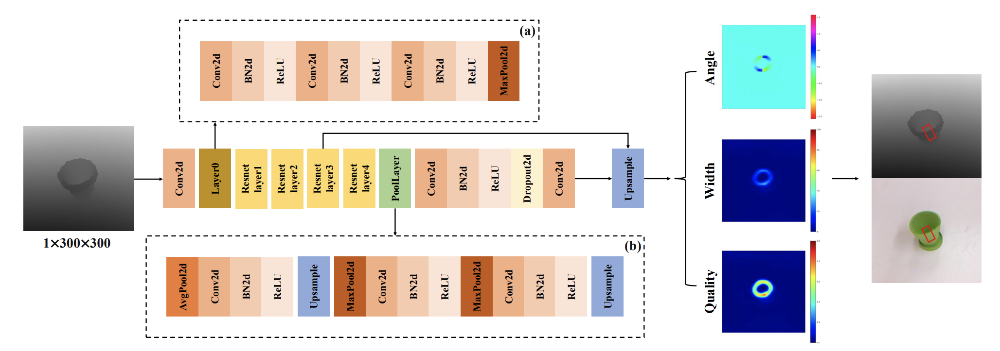

# LGPNet: Alleviating a few Labels and Large-Scale Network Dilemmas in Grasping Detection

## Installation
Python requirements can installed by:
```shell
pip install -r requirements.txt
```

## Dataset
### Cornell Dataset
Training datasets: [Cornell Dataset](https://www.kaggle.com/oneoneliu/cornell-grasp). 
### Jacquard Dataset
Testing dataset: [Jacquard Dataset](https://jacquard.liris.cnrs.fr/)

## Network


### Training

```shell
# Train LGPNet on Cornell Dataset
sh train_cornell.sh

# Train LGPNet on Cornell Dataset
sh train_jacquard.sh
```

## Contact Information

Email: tianhe_wu@foxmail.com


