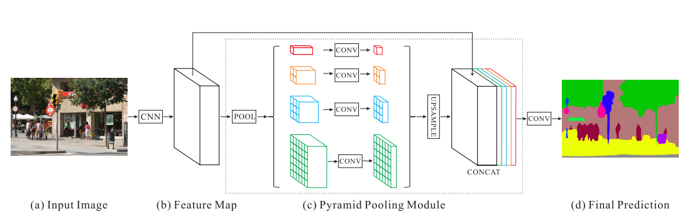

# Grasping Pooling Neural Network
> **Note：** this work is based on [ggcnn](https://github.com/dougsm/ggcnn).

I will use the improved [PSPNet](https://github.com/hszhao/semseg) to optimize the GG-CNN semantic segmentation network. And conduct knowledge distillation operation inside ResNet. A semi-supervised learning method is added to training process.

## Installation
This code was developed with Python 3.9.6 on Windows10. Python requirements can installed by:
```shell
pip install -r requirements.txt
```

## Dataset
### Cornell Dataset
Training datasets: [Cornell Dataset](https://www.kaggle.com/oneoneliu/cornell-grasp). 
### Jacquard Dataset
Testing dataset: [Jacquard Dataset](https://jacquard.liris.cnrs.fr/)

## Network
The network used for main feature extraction is ResNet. Use the pyramid pooling structure to aggregate the global information of the feature map. Finally, use bilinear interpolation for upsampling.



This project must require `input_channel = 1` and `output_channel = 1`. I add `conv0` into pspnet. Before sending into resent, data channel is transformed to fit the resnet. More details about the network in [Network Information](https://github.com/TianheWu/tsinghua-weekwork) weekwork 5-10. The model with auxiliary loss trained has a higher accuracy in validation dataset (90%).

### Training

```shell
# Train PSPNet on Cornell Dataset
python train_net.py --description training_example --network pspnet --dataset cornell --dataset-path <Path To Dataset>

# Train GGCNN on Cornell Dataset
python train_net.py --description training_example --network ggcnn --dataset cornell --dataset-path <Path To Dataset>
```

### Important Issues in Training
- Pay attention to `num_workers` or you can't train your model.
    ```python
    parser.add_argument('--num-workers', type=int, default=2, help='Dataset workers')
    ```
    Make sure your computer or server can support. (The parameter is preferably **a multiple of two and less than the number of cores** )

- Resnet can not load `pre-trained` file.

    This issue can be find in [Issue in semseg](https://github.com/hszhao/semseg/issues/73). The new pre-trained model can be downloaded in [Pre-trained resnet models](https://drive.google.com/drive/folders/1Hrz1wOxOZm4nIIS7UMJeL79AQrdvpj6v). It only contains resnet50, 101, 152.

- Pay attention to `batch_size`, when you input `args.batch_size == 1`, it can't work.

## Knowledge Distillation

Knowledge distillation can make a lightweight model. The model of pspnet with resnet50 accuracy can approach to pspnet with resnet101.
- Train a teacher model (PSPNet with Resnet50)
- Use teacher model to output a value `t_label`
- Use student model (PSPNet with Resnet18) to output a value and calculate loss with label, get `s_loss`
- Calculate loss with student model and `t_label` to get `st_loss`
- `ret_loss = st_loss + s_loss`

## MixMatch SSL


## Contact Information

Email: tianhe_wu@foxmail.com


## References
- [Berthelot, David, et al. "Mixmatch: A holistic approach to semi-supervised learning." arXiv preprint arXiv:1905.02249 (2019).](https://arxiv.org/abs/1905.02249)
- [Morrison, Douglas, Peter Corke, and Jürgen Leitner. "Closing the loop for robotic grasping: A real-time, generative grasp synthesis approach." arXiv preprint arXiv:1804.05172 (2018).](https://arxiv.org/abs/1804.05172)
- [He, Kaiming, et al. "Identity mappings in deep residual networks." European conference on computer vision. Springer, Cham, 2016.](https://openaccess.thecvf.com/content_cvpr_2016/html/He_Deep_Residual_Learning_CVPR_2016_paper.html)
- [Zhao, Hengshuang, et al. "Pyramid scene parsing network." Proceedings of the IEEE conference on computer vision and pattern recognition. 2017.](https://openaccess.thecvf.com/content_cvpr_2017/html/Zhao_Pyramid_Scene_Parsing_CVPR_2017_paper.html)
- [Depierre, Amaury, Emmanuel Dellandréa, and Liming Chen. "Jacquard: A large scale dataset for robotic grasp detection." 2018 IEEE/RSJ International Conference on Intelligent Robots and Systems (IROS). IEEE, 2018.](https://arxiv.org/abs/1803.11469)


