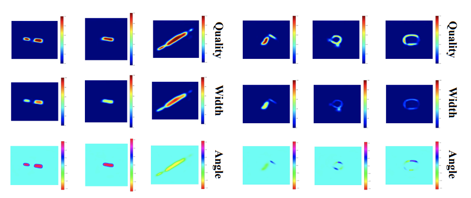

# Lightweight Grasping Pyramid Network

## Abstract
We propose a new semi-supervised learning method, focusing on solving the problems of a few labeled data in natural scenes. Moreover, we propose a novel **Lightweight Grasping Pyramid Network (LGPNet)** with knowledge distillation to solve the large-scale network with high calculating speed. We conduct experiments in the Cornell dataset and Jacquard dataset with **25%** labeled data and **75%** unlabeled data, obtaining state-of-the-art performance with depth images by object-wise data split. The accuracy score reaches 97.2% in the Cornell dataset and 92.4% in the Jacquard dataset.



## Installation
Python requirements can installed by:
```shell
pip install -r requirements.txt
```

## Cornell Dataset & Jacquard Dataset
- [Cornell Dataset](https://www.kaggle.com/oneoneliu/cornell-grasp)
- [Jacquard Dataset](https://jacquard.liris.cnrs.fr/)

## Training
Before you training model, you need to **creat a folder named initmodel under the models folder**. It contains the pre-trained ResNet-18 and ResNet-50 model [Source Files and Pre-trained Models](https://github.com/TianheWu/LGPNet/releases/tag/Version-1). Then you can run the command below to train the model:

### LGPNet-C Training
```shell
# You can train LGPNet-C by this command.
python train_net.py --description <Description of training> \
    --batch-size 8 \
    --network lgpnet \
    --dataset <cornell or jacquard> \
    --dataset-path <Path to your dataset> \
    --layers 50 \
    --gpu-idx 7 \
    --start-split 0.0 \
    --end-split 0.2 

# --laters is the ResNet layer you choose, you can set 18 or 50.
# --start-split is a float number between 0.0-1.0, it means the start postion of split dataset.
# --end-split is a float number between 0.0-1.0, it means the end postion of split dataset.
```
### LGPNet-B Training
LGPNet-B is otaining from MixSSL training. You need to add two extra variable.
```shell
# You can train LGPNet-B by this command.
python train_net.py --description <Description of training> \
    ...
    --end-split 0.2 \
    --trained-net-path <Path to LGPNet-C> \
    --use-ssp 

# --trained-net-path is the model path of LGPNet-C.
# --use-ssp is using MixSSL training method.
```

### LGPNet-A Training
LGPNet-A is otaining from MixSSL and knowledge distillation training.
```shell
# You can train LGPNet-B by this command.
python train_net.py --description <Description of training> \
    ...
    --end-split 0.2 \
    --trained-net-path <Path to LGPNet-B> \
    --use-ssp \
    --use-tea

# --trained-net-path is the model path of LGPNet-B.
# --use-tea is using knowledge distillation training method.
```

## Contact Information
Email: tianhe_wu@emails.bjut.edu.cn
